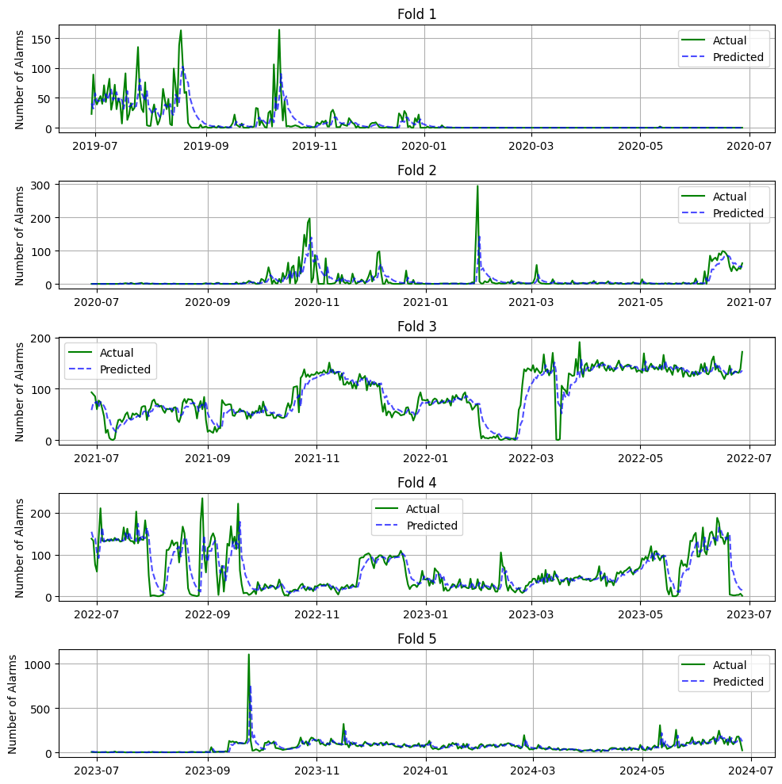
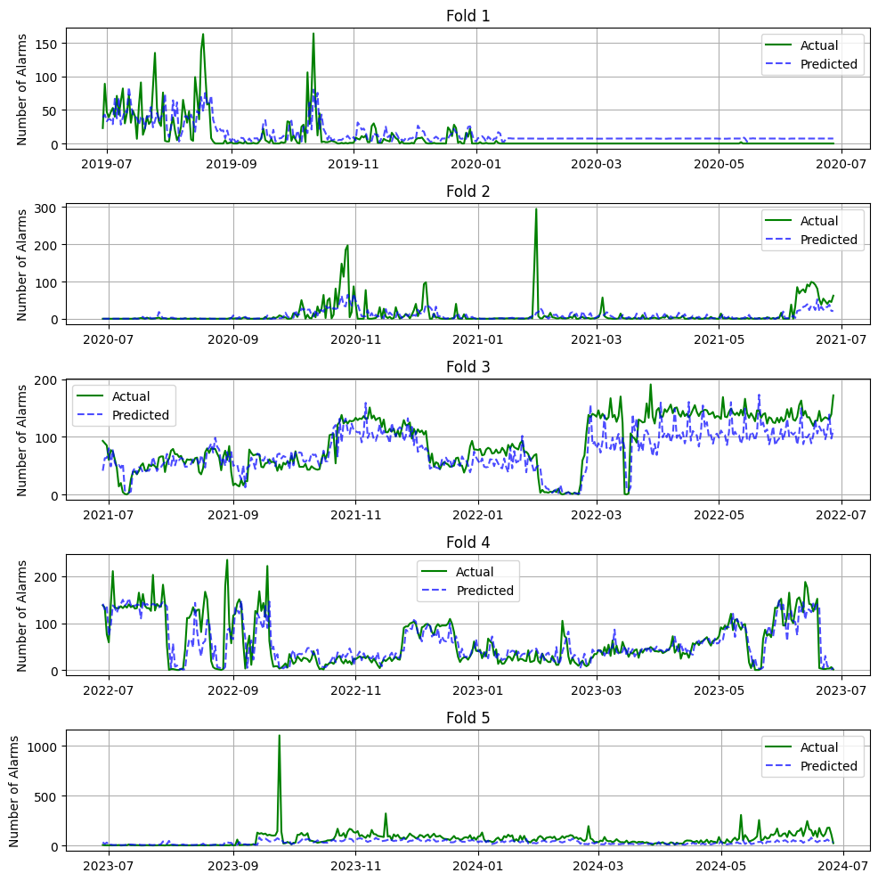
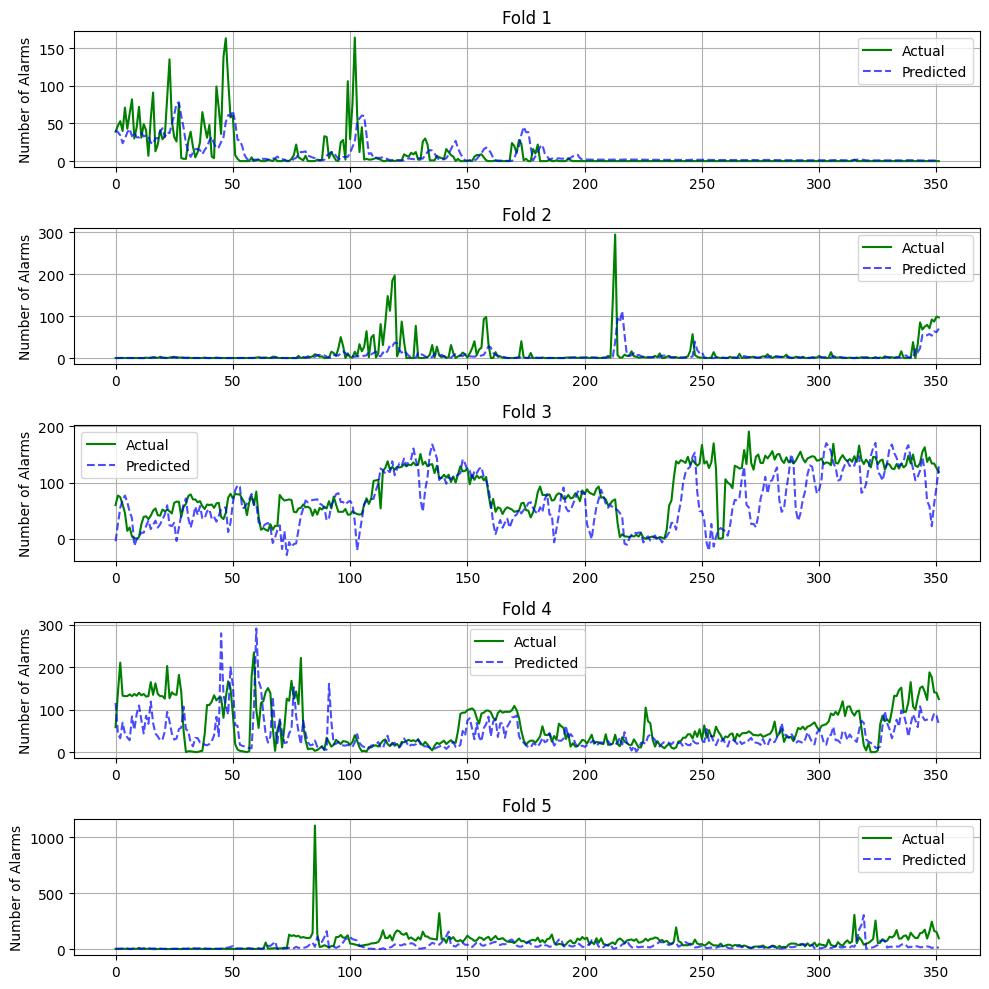
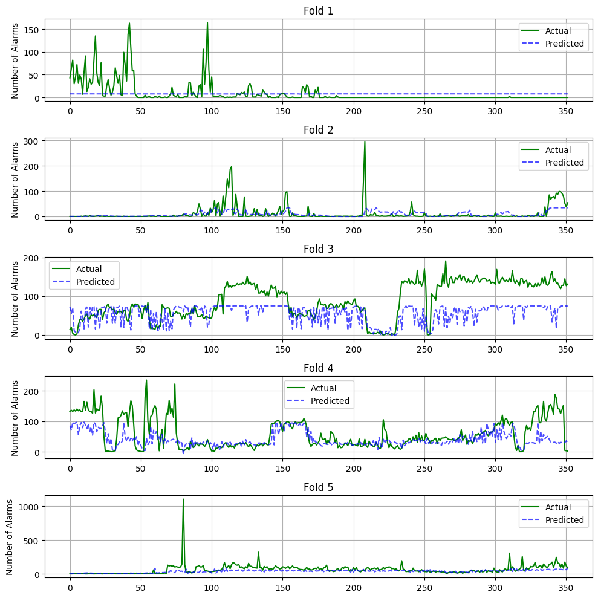
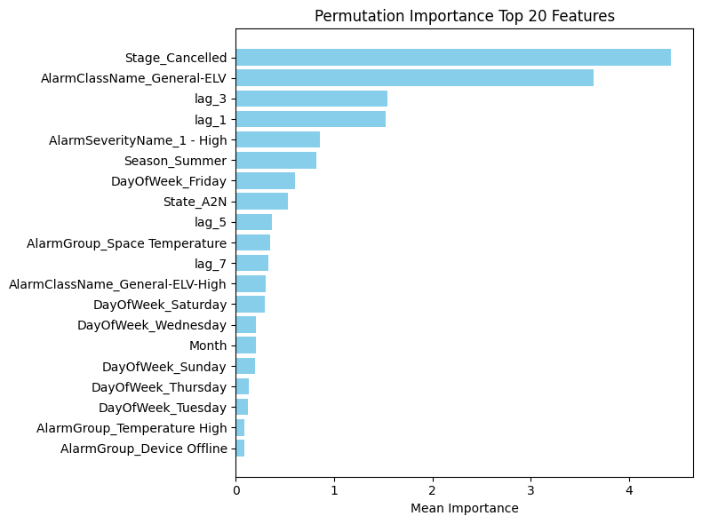

# Time Series Alarm Forecasting

This project analyzes and forecasts alarm activity in industrial time series data.
The notebook is rendered with Quarto and compares multiple model families:

- SARIMAX
- XGBoost
- RNN
- LSTM

## Main Files

- `time_series_alarm_forecasting.ipynb`: source notebook
- `time_series_alarm_forecasting.html`: rendered HTML report
- `time_series_alarm_forecasting.pdf`: rendered PDF report
- `styles.css`: custom Quarto HTML spacing/theme tweaks
- `references.bib`: bibliography

## Render with Quarto

Prerequisites:

- Quarto installed
- A working Jupyter kernel (as configured in the notebook front matter)

Render HTML:

```bash
quarto render time_series_alarm_forecasting.ipynb --to html
```

Render PDF:

```bash
quarto render time_series_alarm_forecasting.ipynb --to pdf
```

## Result 

The forecasts are built on daily aggregated alarms with a one-day-ahead horizon.
All models are evaluated with 5-fold time-series cross-validation (temporal order preserved).

### SARIMAX: Actual vs Predicted



SARIMAX gives a solid statistical baseline and follows the main trend well. In the notebook results, SARIMAX without exogenous variables already improves over the baseline, and using selected exogenous variables improves it slightly more. The main weakness is still visible in this plot: sharp spikes are often delayed or under-predicted.

### XGBoost: Actual vs Predicted



XGBoost captures general variation, but overall it underperforms compared with the better SARIMAX and RNN setups in this project. It is useful as a nonlinear benchmark, but not the strongest final model here.

### RNN: Actual vs Predicted



RNN trained only on alarm history is the strongest model by average RMSE across folds. This matches the notebook conclusion that short-term dependencies are the most useful signal and that adding many exogenous variables introduces noise.

### LSTM: Actual vs Predicted



LSTM is less consistent across validation folds than RNN, but it performs best on Fold 5 (the hardest and most realistic holdout period). In other words, it is not the best on average, but it handled the final test window best.

### XGBoost Feature Importance



This plot helps explain what drives XGBoost predictions and supports feature-level interpretation.


- Best average RMSE: `RNN (alarm)` with `30.70`
- Best Fold 5 RMSE (hardest final period): `LSTM (alarm)` with `61.07`
- Best SARIMAX variant: `SARIMAX (selected exog)` with average RMSE `32.04`
- Baseline average RMSE: `34.47`
- Models with all exogenous variables consistently perform worse (`SARIMAX exog`, `RNN exog`, `LSTM exog`)

Practical takeaway from the project:

- Alarm-history-only models generalize better than "all-exogenous" variants in this dataset.
- Extreme spikes remain difficult for every model, and predictions often react with delay.
- The full end-to-end pipeline runtime is about 5 hours (including cross-validation and model tuning).
